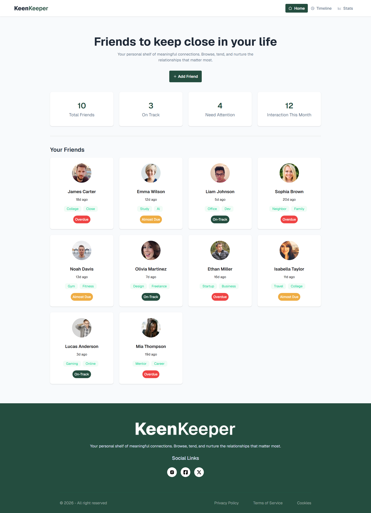
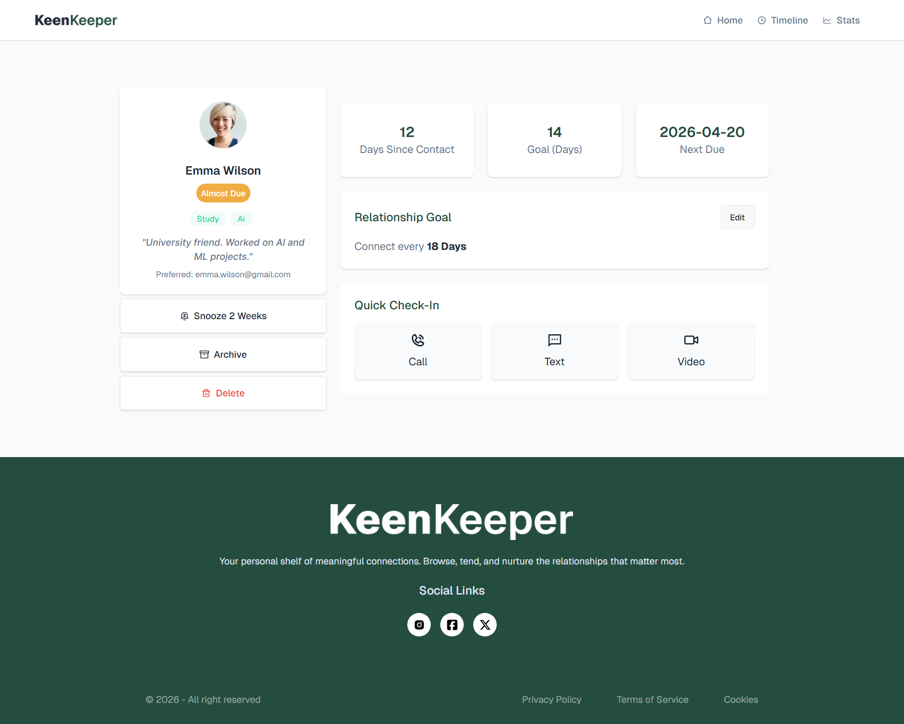
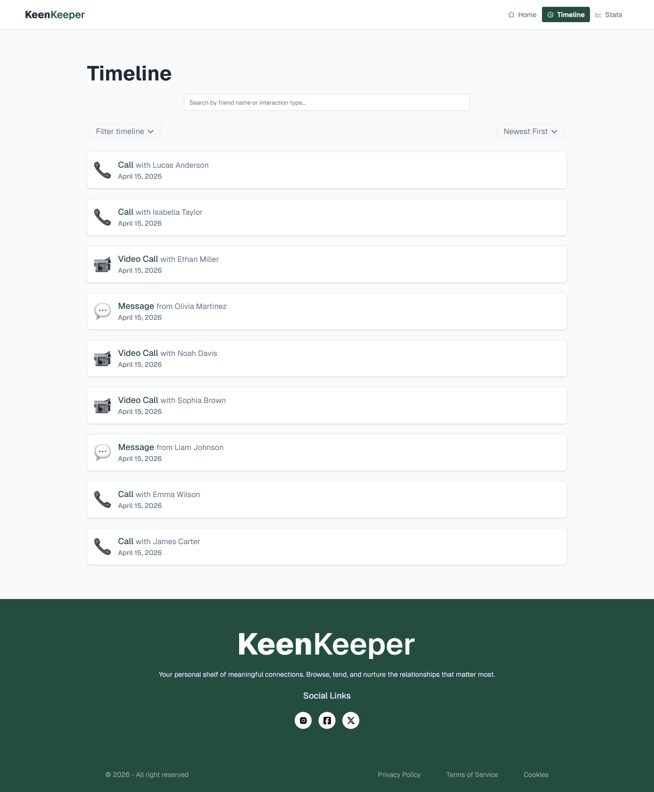
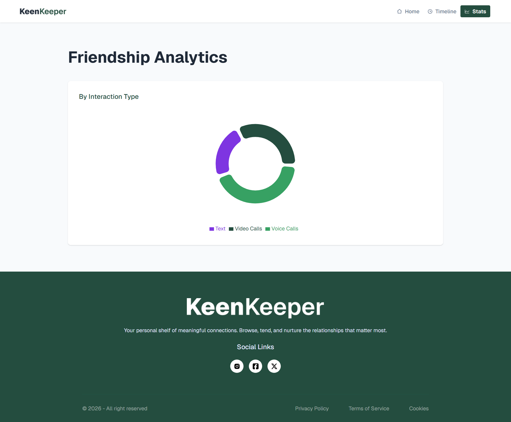

# React + Vite

This template provides a minimal setup to get React working in Vite with HMR and some ESLint rules.

Currently, two official plugins are available:

- [@vitejs/plugin-react](https://github.com/vitejs/vite-plugin-react/blob/main/packages/plugin-react) uses [Oxc](https://oxc.rs)
- [@vitejs/plugin-react-swc](https://github.com/vitejs/vite-plugin-react/blob/main/packages/plugin-react-swc) uses [SWC](https://swc.rs/)

## React Compiler

The React Compiler is not enabled on this template because of its impact on dev & build performances. To add it, see [this documentation](https://react.dev/learn/react-compiler/installation).

## Expanding the ESLint configuration

If you are developing a production application, we recommend using TypeScript with type-aware lint rules enabled. Check out the [TS template](https://github.com/vitejs/vite/tree/main/packages/create-vite/template-react-ts) for information on how to integrate TypeScript and [`typescript-eslint`](https://typescript-eslint.io) in your project.

## Project Name:

B-13-A-07-KEEN KEEPER

## Description:

Keen Keeper is a modern web application designed to efficiently manage contacts, interactions, and personal relationship tracking. It helps users organize important connections, track communication history, and maintain meaningful relationships in a structured way.

## Technology Used:

- React.js
- JavaScript (ES6+)
- Tailwind CSS / CSS
- React Router

## Key Features:

### 1. Contact Management:

Add, view, and manage contacts with detailed information like name, email, and profile image.

### 2. Interaction Tracking:

Track different types of interactions (calls, texts, videos).

### 3. Smart Status System:

Automatically categorize contacts (e.g., active, overdue) based on last interaction time.

## Screenshots:

### Home Page

### Details Page

### Timeline Page

### Stats Page

